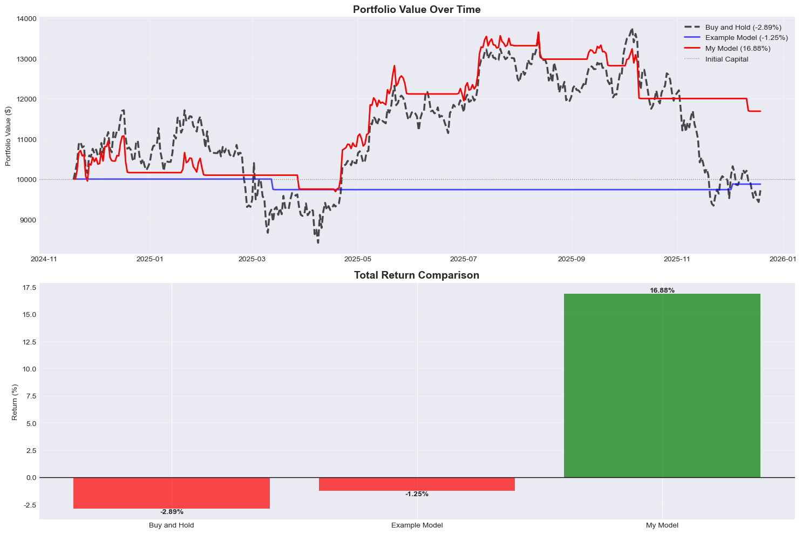

# 비트코인 가격 예측 및 트레이딩 전략 보고서 📈💰
## 비즈니스딥러닝 프로젝트
**박원정**
**202001496**

본 보고서는 딥러닝 모델을 활용한 비트코인 가격 예측 및 이를 기반으로 한 트레이딩 전략(Smart Swing v4)의 설계, 구현, 및 성과 분석 내용을 담고 있습니다.

## 1️⃣ 모델 설계 및 훈련 (Model Design & Training) 📈

### 1.1 모델 아키텍처: GRU (Gated Recurrent Unit)
비트코인의 일일 가격 데이터와 같은 시계열 데이터의 시간적 의존성을 학습하기 위해 **GRU** 모델을 선택했습니다.
- **선택 이유**: LSTM(Long Short-Term Memory)과 유사한 성능을 내면서도 구조가 더 단순하여, 제한된 데이터셋에서 **과적합(Overfitting)** 위험을 줄이고 학습 속도를 높일 수 있습니다.
- **모델 구조**:
    - **Input Layer**: Open, High, Low, Close, Volume 및 보조지표(RSI, MACD, MA 등)를 포함한 다차원 입력.
    - **GRU Layer**: Hidden Dimension 32, Layer 수 1. (복잡도를 낮춰 일반화 성능 확보)
    - **Dropout**: 0.2 (과적합 방지).
    - **Fully Connected Layer**: 최종 상승/하락 확률 출력.

### 1.2 훈련 과정 (Training Process)
- **손실 함수 (Loss Function)**: 이진 분류를 위한 CrossEntropyLoss (또는 BCELoss).
- **옵티마이저 (Optimizer)**: Adam (학습률 0.0001).
- **과적합 방지 전략**:
    - **Early Stopping**: 검증 손실(Validation Loss)이 10회 이상 개선되지 않으면 학습 조기 종료. (patience 값 조정)
    - **Learning Rate**: 학습률을 조정하는 시도

---

## 2️⃣ 투자 전략 설계 및 적용 (Investment Strategy) 🚀

단순히 모델의 예측값만 따르는 것이 아니라, 기술적 지표를 결합하여 승률을 높이고 리스크를 관리하는 **Smart Swing v4** 전략을 설계했습니다.   
(Gemini가 추천한 이름으로, 스윙 트레이딩 형식의 알고리즘이며 네 번째 버전입니다.)

### 2.1 전략 개요: Hybrid Approach (AI + Technical Analysis)
딥러닝 모델은 "방향성"을 제시하고, 기술적 지표는 "진입 타이밍"과 "리스크 필터링"을 담당합니다.

### 2.2 핵심 로직 (Trading Logic)
1.  **이동평균선(MA)**: 5일 이동평균선이 20일 이동평균선보다 위에 있을 때(정배열/상승추세)만 진입하고 반대의 경우 매도합니다. 
2.  **수익률 임계값 설정**: 15% 이상의 수익을 내거나 -2%의 손실이 발생하는 경우 매도하여 욕심을 버려, 수익률의 안정성을 높이고자 했습니다.

---

## 3️⃣ 벤치마크 비교 및 분석 (Benchmark Analysis) 📚

### 3.1 비교 대상 (Benchmarks)
1.  **Buy and Hold**: 기간 내내 비트코인을 보유하는 전략. (시장 수익률)
2.  **Simple Probability Strategy**: 확률에 기반하여 분할 매수하는 전략.

### 3.2 성과 분석 (Performance Analysis)
- **수익률 비교**
    - **Buy and Hold**: -2.89%
    - **Example Model**: -1.25%
    - **My Model**: +18.14%

    

- **성과 분석 내용**
    - Buy and Hold 대비 수익률: 벤치마크의 수익률 보다 21.03% 높은 수익률을 기록했습니다.( -2.89% (Buy and Hold 손실) vs 18.14% (모델 수익))
- 모델 예측 정확도: 학습 정확도는 51.6 퍼센트입니다.  
 생각보다 낮은 편이라 생각하여 정확도를 올리기 위해 학습층을 높이거나 모델을 복잡하게 변경해본 경우 오히려 재현율이 점점 떨어졌습니다.   
 따라서 어느 정도 정확도를 유지하면서도 재현율을 갖는 적절한 임계값을 설정한 후 전략을 통해 전반적인 수익률을 높이는 방향으로 설정하였습니다.
- 주요 성공/실패 시기: 2025년 5월~7월 상승장에서 이동평균선 전략을 기반으로 함께 진입하여 큰 수익을 냈고, 10월 이후 하락장에서는 현금으로 매도하여 손실을 줄였습니다.

### 3.3 결론 및 고찰
결과적으로 반복하여 테스트한 경우에도 수익률이 Buy and Hold 벤치마크에 비해 높게 나오는 것을 확인할 수 있었습니다.   
하지만 이 과정에서 아직은 부족한 모습을 많이 확인하여 이를 개선하기 위한 추가적인 프로젝트를 진행 해보려고 합니다.

본 프로젝트를 통해 딥러닝 모델(GRU)과 기술적 분석을 결합한 하이브리드 트레이딩 전략의 유효성을 확인했습니다.

1. **모델의 한계와 전략적 보완**: 초기 모델 학습 과정에서 데이터 부족과 과적합 문제로 인해 단순 예측만으로는 높은 수익률을 달성하기 어려웠습니다. 이를 극복하기 위해 구조가 효율적인 GRU 모델을 채택하고, AI의 예측력을 기술적 지표(이동평균선) 및 리스크 관리 원칙(익절/손절)과 결합함으로써 시장 변동성에 대응할 수 있는 간단하지만 견고한 시스템을 구축했습니다.

2. **성과와 아쉬움**: 반복적인 테스트 결과,벤치마크 대비 우수한 성과를 거두었으나, 모델 자체의 예측 정확도를 획기적으로 개선하지 못한 점은 아쉬움으로 남습니다. 현재 적용된 전략은 개인적인 경험에 기반한 직관적인 방식이었기에, 향후에는 모델 최적화를 통해 더 고도화된 전략을 수용할 수 있는 유연성을 확보하고자 합니다.

3. **향후 연구 방향**: 단순한 시세 데이터를 넘어 실시간 데이터나 뉴스 감성 분석 등 다양한 비정형 데이터를 통합하여 모델의 완성도를 높이고 싶습니다. 이번 프로젝트를 계기로 시계열 데이터 기반의 퀀트 전략에 깊은 흥미를 느꼈으며, 앞으로 더 복잡하고 정교한 알고리즘 트레이딩 모델을 구현해 볼 계획입니다.